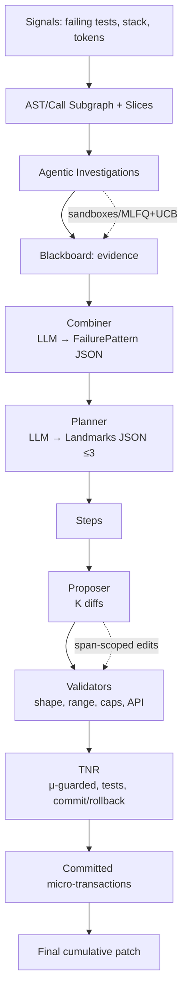

# coding-in-parallel

Autonomous, AST-guided bug-fixing with deterministic orchestration and transactional no-regression (TNR) execution. Designed for on-demand evaluation against SWE-bench Verified.

This agent localizes likely fault spans using AST and signals from failing tests, investigates suspects in parallel with sandboxed probes, fuses evidence into a single failure pattern, plans 1–3 atomic landmarks, proposes small diffs, validates them against strict gates, and commits only if the transaction does not regress (µ non‑worsening, tests green). If a candidate fails gates, it is rolled back and the search continues.

## Table of contents

1. Project overview
2. Current status (what’s present vs missing)
3. Architecture and pipeline
4. AST localisation and index
5. Investigations: sandbox, scheduler, blackboard
6. Transaction semantics (TNR)
7. Configuration and runbook (SWE-bench)
8. Logging and artifacts
9. Evaluation plan
10. Roadmap and improvements
11. Development

## 1) Project overview

`coding-in-parallel` executes a 10-stage algorithm:

1. Localize: Build an AST/call subgraph (2 hops, ≤40 nodes) from failing tests; rank spans using stack traces, tokens, and coverage.
2. Select: Choose 5–7 high-value suspect entities (functions/methods).
3. Probe: Run parallel read-only investigative probes (AST, grep, trace/coverage).
4. Analyze: Each probe outputs structured notes about failure patterns.
5. Combine: Aggregate probe results into a concise failure pattern + candidate fixes.
6. Plan: Decompose into 2–4 atomic landmarks with constraints and ideal outcomes.
7. Propose: Generate K unified diff candidates per landmark, scoped to spans.
8. Validate: Diff validators (LOC, file allowlist, line-range, API/minimality guard).
9. Transact: Checkpoint, apply, gate (static, targeted tests, µ), commit/rollback.
10. Iterate: Move landmark-by-landmark; final patch is the passing, constrained diff.

## 2) Current status

The codebase includes an executable end‑to‑end spine with configurable OpenAI integration, streaming logs, and µ‑guarded transactions. Unit and integration tests pass locally (see Development).

Implemented

- Data models (`types.py`) matching the spec for candidates, spans, landmarks, diffs, and transactions.
- Controller (`controller.py`) orchestrating investigations → planning → proposing → TNR with reason‑aware retries and cumulative diff from baseline..HEAD.
- Investigations (`investigator.py`): recall + probe prompts; minimal sandboxed investigative loop with blackboard and an MLFQ+UCB scheduler stub.
- Sandbox + I‑TX kernel (`probes/sandbox.py`, `probes/runner.py`): isolated temp dirs; apply investigative patches and always rollback.
- Blackboard store (`probes/blackboard.py`): merge + dedup; snapshotting.
- Scheduler (`probes/scheduler.py`): PCB model, multi‑level queues, UCB‑style gain selection.
- Combiner + planner (`combine.py`, `planner.py`): strict JSON contracts for FailurePattern and Landmarks; robust parsing for synthesize/plan responses.
- Proposer (`proposer.py`): K diffs per step, scoped to span windows, with payload rendering of line windows and file whitelist.
- Validators (`validate.py`): unified diff shape, file whitelist, line‑range compliance, LOC/file caps, API guard for signature changes.
- TNR (`tnr.py`): transactional patching with gates (static, targeted tests) and µ non‑worsening; commit or rollback per finalist.
- VCS (`vcs.py`): checkpoint/reset/apply/commit and final diff extraction.
- LLM shim + OpenAI adapter (`llm.py`, `llm_openai.py`): opt‑in via `CIP_USE_OPENAI=1`, default model `gpt-5`, Responses API with chat fallback.
- Streaming run logging (`logging.py`): `.agent_runs/<id>/events.ndjson` live events, plus JSON/TXT artifacts for blackboard/failure/landmarks/plan/transactions/final_patch.

Gaps / next work

- Subgraph + SBFL localization: 2‑hop AST/call graph, Ochiai scoring, slice selection.
- Smarter probes: instrument/assert probes, coverage/trace extraction, info‑gain metrics.
- Rerank heuristics and tiny judge (`rerank.py`).
- Branch manager (`branch_manager.py`): AND/OR hypotheses transaction orchestration.
- More robust API guard (class methods, decorators, async, kw‑only/pos‑only parameters).
- Prompt logging (opt‑in) with redaction/caps.
- Concurrency for probes (today sequential for determinism in tests).
- SWE‑bench adapter utilities for signals and environment setup.

## 3) Architecture and pipeline

High‑level flow (investigations → fusion → planning → TNR):

```
Signals (failing tests, stack, tokens)
   ↓
AST/Call Subgraph + Slices (≤12)
   ↓
Agentic Investigations (sandbox, probes, I‑TX)  →  Blackboard (evidence)
   ↓                                               ↑
Combiner (LLM → FailurePattern JSON)              │
   ↓
Planner (LLM → Landmarks JSON ≤3)
   ↓
Per‑Landmark Steps → Proposer (K diffs) → Validators → TNR (μ‑guarded, gated)
   ↓
Committed micro‑transactions → Final cumulative patch
```

Key components

- Controller: orchestrates, collects artifacts, and coordinates retries.
- Investigations: scheduler + blackboard + sandboxed probe runner.
- Combiner/Planner: strict JSON contracts with retries on invalid JSON (in code paths).
- Proposer/Validators: produce and constrain diffs to the allowed files/line windows.
- TNR: apply finalists one‑by‑one; commit only when gates pass and µ does not worsen.

Mermaid diagram (rendered on GitHub):



## 4) AST localisation and index

Implemented

- `ast_index.build_index(repo)`: walks `*.py`, parses with `ast.parse`, records symbol spans (`FunctionDef`, `ClassDef`) and call-sites with `_CallVisitor`. Provides `lookup_symbol`, `lookup_calls`, and `slice(file, start, end, padding)`.

Planned extensions

- Qualified names: index fully-qualified symbols (module/class/function) and imports.
- Call graph: build def→call edges and reverse call edges; expose a bounded subgraph builder `build_call_subgraph(symbols, hops=2, max_nodes=40)`.
- Localize: combine traces, token matches, and coverage/SBFL to rank spans; select 5–7 suspects (unique function/methods) as `AstSpan`s with scores and evidence.

## 5) Investigations: sandbox, scheduler, blackboard

Implemented (minimal, deterministic for tests)

- Sandboxes: temp work dirs with apply/rollback lifecycle; investigative patches always rolled back.
- Blackboard: thread‑safe-ish store with merge/dedup; snapshot persisted to JSON.
- Scheduler: multi‑level queues with a simple UCB‑style info‑gain index; supports preemption and boosting.
- I‑TX kernel: applies small probe patches, runs targeted tests with timeout, collects artifacts, computes naive info_gain.

Planned

- Worktree isolation via `git worktree` for probe sandboxes.
- Coverage + trace instrumentation via `sitecustomize.py`.
- Concurrent probe pool (bounded) with MLFQ scheduling.

Probe discipline

- Probes can execute tests/coverage and read artifacts, AST slices, and source text; they never persist edits to the primary worktree.

## 6) Transaction semantics (TNR)

We adopt Transactional No-Regression (TNR) semantics inspired by [TNR (arXiv:2506.02009)](https://arxiv.org/pdf/2506.02009). A transaction is an atomic attempt to apply one candidate diff for a plan step.

Definitions

- Baseline state: repository at a git checkpoint `HEAD` before applying a candidate.
- µ (churn proxy): average of added/removed lines from `git diff --numstat`.
- Targeted tests: the SWE-bench instance’s failing tests (and optionally a curated subset of related tests).

Transaction procedure

1. Checkpoint: record `HEAD`.
2. Validate: unified diff shape; file allowlist (span files only); LOC ≤ limit; line edits within span ±padding; optional API guard.
3. Apply: attempt `git apply`; fallback to manual hunk application; abort on failure.
4. Gates:
   - Static: `py_compile` over repo (configurable).
   - Tests:
     - If `gates.targeted_tests`: run targeted tests; require they pass post-apply.
   - µ guard: if enabled, require `µ_post ≤ µ_pre` for non-targeted-test mode.
5. Commit or rollback:
   - If all gates pass, `git commit -m "txn:<step-id>"`.
   - Else, hard reset to checkpoint and continue with next candidate.

Ultimate TNR criterion (SWE-bench Verified)

- Success is achieved if the instance’s specified failing test(s) pass post-transaction, without introducing targeted-test regressions, within configured diff limits.

Notes

- Non-targeted baselines may optionally require that a smoke subset remains green.
- All transactions are revertible; no partial commits.

## 7) Configuration and runbook (SWE-bench)

CLI

```bash
coding-in-parallel \
  --repo /path/to/repo \
  --task /path/to/instance.json \
  --out /tmp/patch.diff \
  --test-cmd "pytest -q" \
  --config config.yaml
```

LLM setup (OpenAI)

- Enable OpenAI client via env (opt‑in to avoid affecting tests):

```bash
export CIP_USE_OPENAI=1
export OPENAI_API_KEY="<your-key>"
# Optional overrides
export OPENAI_MODEL="gpt-5"            # default if unset
export OPENAI_BASE_URL="<custom>"       # if using a proxy/Azure
```

Example `config.yaml`

```yaml
model:
  provider: openai
  name: gpt-5
search:
  max_steps: 3
  diffs_per_step: 3
  finalists: 2
  retries_per_step: 1
limits:
  max_loc_changes: 12
  max_files_per_diff: 2
  slice_padding_lines: 60
tnr:
  actions_per_txn: 3
  require_mu_nonworsening: true
gates:
  static: true
  targeted_tests: true
  smoke: false
logging:
  dir: .agent_runs
  stream: true  # echo events to console
```

Runbook (on-demand SWE-bench)

1. Checkout the SWE-bench repository-under-test at the instance commit.
2. Ensure the failing test metadata JSON (instance) is available.
3. Set up your LLM client and `config.yaml`.
4. Run the CLI as above; collect `.agent_runs/<instance_id>/*` artifacts and `/tmp/patch.diff`.

Tip: prefer `python -m pytest -q` in `--test-cmd` to avoid sys.path issues in some repos.

If your instance JSON includes `failing_tests`, the controller derives a targeted `-k` expression to speed runs.

Troubleshooting

- "No LLM client configured": ensure `CIP_USE_OPENAI=1` for that process and `OPENAI_API_KEY` is exported.
- "model_not_found": set `OPENAI_MODEL` to a model you have access to (e.g., `gpt-4o-mini`).
- Import errors in tests: switch to `python -m pytest -q` or activate the repo’s venv in `--test-cmd`.

## 8) Logging and artifacts

All runs log under `.agent_runs/<instance_id>/` (or a timestamp if instance_id is missing):

- `events.ndjson`: live event stream (newline‑delimited JSON). Enable console echo via `CIP_LOG_STREAM=1` or `logging.stream: true`.
- `candidates.json`: recalled/probed candidates.
- `blackboard.json`: suspects + invariants + evidence snapshot.
- `failure_pattern.json`: combiner output.
- `landmarks.json`: planner output (when enabled).
- `understanding.json`, `plan.json`: planner (non‑landmarks path) artifacts.
- `transactions.json`: per‑step transaction decisions and µ trace.
- `final_patch.txt`: final cumulative diff.

Common event kinds (partial list):

- `controller.start|finish`, `vcs.checkpoint`
- `candidates.recalled|probed`
- `investigations.start|done`, `combine.start|done`
- `planner.landmarks.start|done`, `planner.synthesize.start|done`
- `step.begin|test_cmd`, `proposer.start|done|retry`, `txn.start|result|retry`

References: [SWE-bench](https://github.com/princeton-nlp/SWE-bench) and [SWE-bench website](https://www.swebench.com).

## 9) Evaluation plan

- Dataset: choose 5–10 SWE-bench Verified instances across 3 repos for a smoke eval.
- Metrics: success rate (targeted tests green), LOC/files touched, number of transactions, latency per stage, µ pre/post.
- Criteria: ≥1 success per 5 instances initially; zero targeted-test regressions.
- Logging: persist prompts, LLM responses, diffs, gate outputs in `.agent_runs/<run-id>`.

## 10) Roadmap and improvements

Improvements under consideration

- Subgraph + SBFL: attach Ochiai scores to nodes; slice selection (≤12 slices) to focus proposer context.
- Reranker: incorporate distance to primary span, diff size, and heuristic linting signals.
- Branch manager: maintain posteriors over hypotheses and evaluate expected utility; execute AND chains or OR branches transactionally.
- Reason‑aware replanning: on repeated recoverable failures, regenerate proposals; then re‑invoke planner; optionally recombine with updated blackboard.
- API guard hardening: nested defs, class methods, decorators, async functions, kw‑only/pos‑only parameters.
- Probe information gain: formalize gain metric using variance reduction over hypotheses; add scheduler boosting signals for stack hits and invariants.
- Coverage/trace integration: inject `sitecustomize.py` to capture line hits and stack/local snapshots.
- Prompt logging: opt‑in redacted prompt/response artifacts; token caps to prevent drift.
- µ metric: discount whitespace‑only changes and weight touched files.

## 11) Development

Install

```bash
python -m venv .venv
source .venv/bin/activate
pip install -e .[test]
```

Test

```bash
pytest
```

Run

```bash
coding-in-parallel --help
```

LLM client

Register once before running the agent:

```python
import coding_in_parallel as cip

class MyClient:
    def complete(self, prompt: str, **kwargs):
        # return model output as string
        ...

cip.llm.set_client(MyClient())
```

License: see `LICENSE`.
